# Laboratorio 02 — Estrategias de Trading con Análisis Técnico

**Microestructuras y Sistemas de Trading · ITESO · Equipo 2 · Nivel C**
Integrantes: Milca (NFLX, TSLA), Paula (AMZN, META), Arturo (GOOGL, NVDA).

## 1. Resumen ejecutivo

Construimos un sistema de trading diario long/short sobre NVDA, AMZN, TSLA, META, NFLX y GOOGL que
abre posiciones solo cuando 2 de 3 indicadores (EMA, RSI, Bollinger) coinciden, ajusta sus
parámetros por régimen de mercado (K-means) y dimensiona con Risk Parity (Spinu) multiplicado por
la fuerza de la señal y por m(régimen). Todo se optimizó con Optuna maximizando Calmar en un
walk-forward 6→1 meses dentro de TRAIN (2015-01-02 a 2024-04-26).

- **WF-OOS (TRAIN, 2016-07-01 a 2024-04-26):** CAGR 0.4%, volatilidad
  4.7%, MDD 10.8%, Calmar 0.04, Sharpe 0.11,
  286 operaciones (216 largas / 70 cortas).
  Buy & Hold EW: CAGR 44.6%, MDD 61.7%, Calmar 0.72.
- **Walk-forward efficiency:** WFE de rendimiento 0.02 y de Calmar
  0.00 (rolling); anchored: -0.10 / -0.03.
- **Costos:** el punto de equilibrio está en una comisión de 0.183% por lado
  (margen de seguridad 1.47× frente a 0.125%).
- **TEST:** [PENDIENTE: test]

Conclusión: el sistema tiene Calmar WF-OOS positivo (0.04); con un CAGR (0.4%) muy inferior al Buy & Hold (44.6%) porque la exposición media es baja (9.9%); y una WFE de 0.02 < 0.5 indica que la mayor parte del desempeño in-sample es ajuste a la muestra, no una ventaja estable; el veredicto final depende del TEST [PENDIENTE: test].

## 2. Datos y auditoría

- Fuente: Yahoo Finance vía yfinance, diario, `auto_adjust=True` (OHLC ajustados por splits y
  dividendos). Datos congelados en `data/prices_daily.csv`; `main.py` nunca re-descarga.
- Periodo: 2015-01-02 a 2026-08-31;
  incluye Q4-2018, COVID-2020, el bear market de 2022 y el choque de abril de 2025.
- Split cronológico sin traslape: TRAIN 2015-01-02 a 2024-04-26
  (2345 días); TEST 2024-04-29 a 2026-08-31 (587 días).
- Auditoría (`auditoria_datos.csv`): 0 fechas faltantes,
  0 NaNs, 0 duplicados,
  0 inconsistencias OHLC,
  0 precios ≤ 0. Rendimientos extremos |r| > 25%:
  NVDA 2016-11-11: +29.8%; META 2022-02-03: -26.4%; NFLX 2022-04-20: -35.1%
  — todos son reacciones a reportes trimestrales (eventos reales), no splits mal ajustados.
  La limpieza (solo fechas comunes a los 6, sin forward-fill) eliminó 0 filas.
- **Selección y sesgos:** activos asignados con `random.seed(42)` → `random.sample` → pares en orden
  alfabético de integrantes. Son seis mega-cap tecnológicas que hoy sabemos ganadoras (sesgo de
  supervivencia y de selección): el Buy & Hold es un benchmark muy difícil de vencer en retorno,
  por eso el sistema se juzga por Calmar y riesgo. Además están muy correlacionadas, así que la
  diferencia entre Risk Parity y pesos iguales viene sobre todo de volatilidades distintas.

## 3. Indicadores y regla 2 de 3

Tres familias, implementadas a mano en `src/signals.py`:

1. **Tendencia — cruce de EMAs:** EMA_t = α·P_t + (1−α)·EMA_{t−1}, α = 2/(h+1).
   x₁ = +1 si EMA rápida > EMA lenta; −1 si es menor.
2. **Momento — RSI de Wilder:** x₂ = +1 si RSI < umbral inferior; −1 si RSI > umbral superior; 0 en otro caso.
3. **Volatilidad — Bandas de Bollinger:** MB = SMA_N, UB/LB = MB ± k·σ_N.
   x₃ = +1 si close < LB; −1 si close > UB; 0 dentro.

El ATR de Wilder (14 días) no vota: fija SL/TP.

**Regla de confirmación (Paso 7.2 de las notas), k = 3:**
s_i = (1/k)·Σ_j x_{i,j} si |Σ_j x_{i,j}| ≥ 2; s_i = 0 en otro caso. Por tanto s_i ∈ {−1, −2/3, 0, +2/3, +1}:
la *compuerta* (¿hay posición?) y la *fuerza* (¿cuánto riesgo?) se separan.
**Caso borde:** con votos (+1, +1, −1) la suma es 1 < 2 y **no se abre**: abrir exige 2 a favor y
ninguno en contra, o 3 a favor.

Interpretación económica: la regla abre en un *pullback* dentro de una tendencia (EMA + un
oscilador de acuerdo: comprar sobreventa en tendencia alcista, vender sobrecompra en tendencia
bajista) y con 3 de 3 cuando ambos osciladores confirman. **Hallazgo:** como la EMA siempre vota ±1,
con la EMA en contra la suma máxima es −1 + 1 + 1 = 1 < 2; por tanto la regla **nunca abre contra la
tendencia de la EMA** (fuera del calentamiento, cuando la EMA aún vota 0). El caso "reversión fuerte
contra la tendencia con RSI y Bollinger de acuerdo" que sugiere la formulación general no puede
ocurrir con estos tres indicadores: RSI y Bollinger funcionan como *timing* de entrada, y la EMA
como filtro de dirección.

Correlación promedio entre votos (θ congelado, WF-OOS): EMA–RSI -0.25, EMA–Bollinger
-0.13, RSI–Bollinger 0.31. Ninguna supera 0.7: los tres aportan información distinta (RSI y Bollinger son los más parecidos, como se espera de dos osciladores).

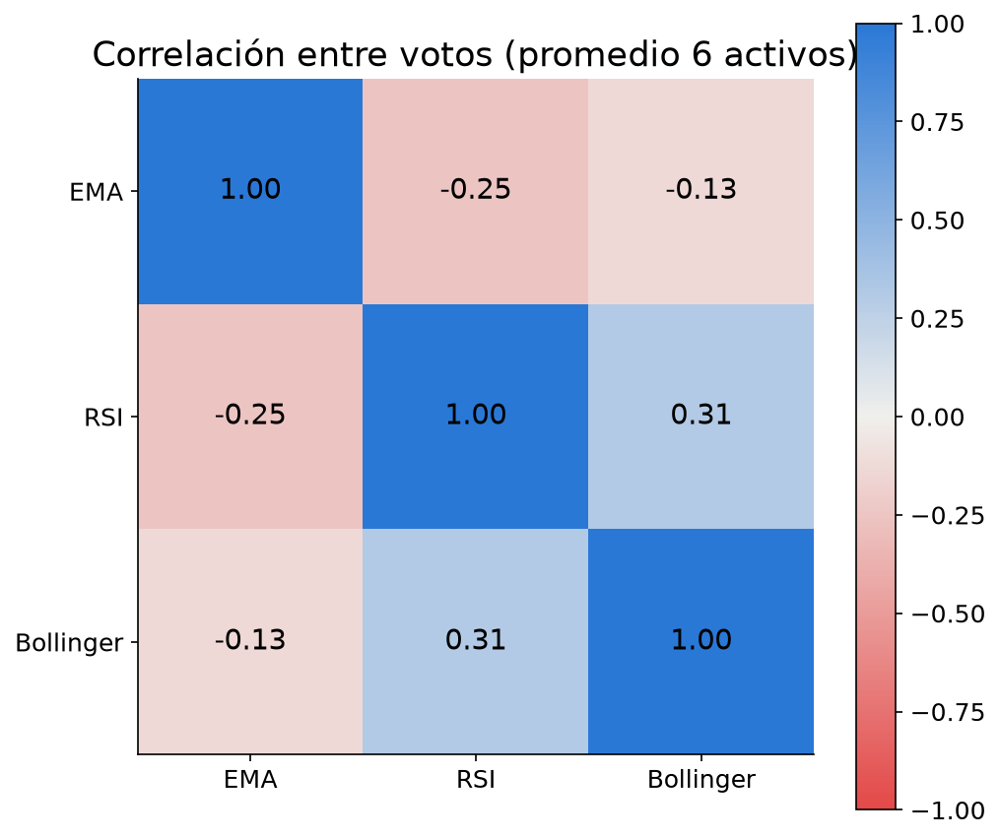

## 4. Motor de backtest y convenciones

Motor event-driven (`src/backtest.py`), un solo motor para 1 o 6 activos, loop diario sobre arrays:

1. **Open de t:** primero gaps (si el open rebasó SL/TP de una posición previa, sale al open);
   luego se ejecutan las órdenes decididas al cierre de t−1. Toda señal se ejecuta en **t+1**.
2. **Durante t:** SL/TP con high/low, incluida la barra de entrada; **si SL y TP caen en la misma
   barra, se ejecuta primero el SL** (conservador).
3. **Cierre de t:** borrow fee (solo escenario realista), marca a mercado y decisiones con datos ≤ t.

SL/TP: largo SL = P_in − m_sl·ATR, TP = P_in + m_tp·ATR (corto al revés), con el ATR del día de la
señal y niveles fijos. Salidas: SL, TP, señal confirmada contraria (cierra y abre en reversa pagando
ambas comisiones), time-stop `max_hold`, entrada a Crisis y rebalanceo; una señal 0 no cierra.
Flujos: compra Cash −= q·P·(1+c); venta Cash += q·P·(1−c); un corto abre con Cash += q·P·(1−c) y
pasivo q < 0; Equity = Cash + Σ q_i·P_i. Comisión oficial c = 0.125% por lado.
**Sin apalancamiento:** antes de ejecutar, si Σ|q_i·P_i| > Equity/(1+c) se escalan las posiciones;
la exposición bruta máxima observada en WF-OOS fue 0.666.
Con exposición ≤ 100% el margen de cortos (50% inicial, 25–30% mantenimiento) siempre se cumple.

## 5. Optimización

- Optuna `TPESampler(n_startup_trials=30)`: 30 trials aleatorios y luego TPE (Random Search →
  Bayesiana en un solo estudio); semilla por estudio derivada de SEED = 42 y (ventana, activo, régimen).
- Objetivo: **Calmar** del backtest de train con `entry_mask` del régimen j; si θ produce menos de
  N_MIN operaciones el objetivo vale −1e9. **N_MIN adaptado a 5 (global) / 3 (régimen):** con datos
  diarios y la regla 2 de 3 solo el 1% de los pares (ventana, activo) alcanza 10 operaciones en
  6 meses con *cualquier* θ (72% alcanza 5); con 10 casi todo caería al fallback.
- Purga y embargo: en train se cierran las posiciones el último día usado y los últimos
  5 días del train se excluyen del objetivo.
- **θ robusto:** mediana de cada parámetro entre el 10% de mejores trials válidos (centro de la meseta).
- Espacio θ: EMA rápida 5–30, gap 10–100, RSI 7–28 / 20–40 / 60–80, Bollinger 10–40 / 1.5–3.0,
  m_sl 1–4, m_tp 1–6, max_hold 5–40. El tamaño de posición no se optimiza (el Calmar es casi
  invariante a la escala; lo fijan Risk Parity y m(régimen)).
- **100 trials por estudio** (por ventana y activo: 1 global + 3 regímenes);
  95 ventanas rolling y 95 anchored.
  **Configuraciones evaluadas en TRAIN: 416,300**.
  **Tiempo de optimización:** 0.30 h de reloj (etapa TRAIN completa; 1.84 h de CPU en 7 procesos).
- Fallbacks a θ global (régimen con < 20 días o sin trials válidos), variante oficial: Crisis: 368 de 570; Reversión: 348 de 570; Tendencia: 332 de 570.
  Estudios globales sin ningún trial válido: anchored por_activo: 180 de 570 (180 heredan el θ de la última ventana válida, 0 usan el θ por defecto); rolling compartido: 44 de 95 (44 heredan el θ de la última ventana válida, 0 usan el θ por defecto); rolling por_activo: 169 de 570 (169 heredan el θ de la última ventana válida, 0 usan el θ por defecto).
  Que tantas ventanas de 6 meses no alcancen el mínimo de operaciones es en sí un resultado: con
  datos diarios, la regla 2 de 3 genera pocas señales por semestre.
- **Variante elegida por Calmar WF-OOS en TRAIN: por_activo.**

| Esquema | variante | CAGR | MDD | Calmar | # ops | WFE rend. | WFE Calmar |
|---|---|---|---|---|---|---|
| rolling | por_activo | 0.3% | 10.9% | 0.03 | 286 | 0.02 | 0.00 |
| rolling | compartido | -0.5% | 19.1% | -0.03 | 384 | -0.11 | -0.01 |
| anchored | por_activo | -1.1% | 16.9% | -0.06 | 249 | -0.10 | -0.03 |

Diagnóstico de Optuna (NVDA, última ventana de TRAIN 2023-11-01 a 2024-04-26):

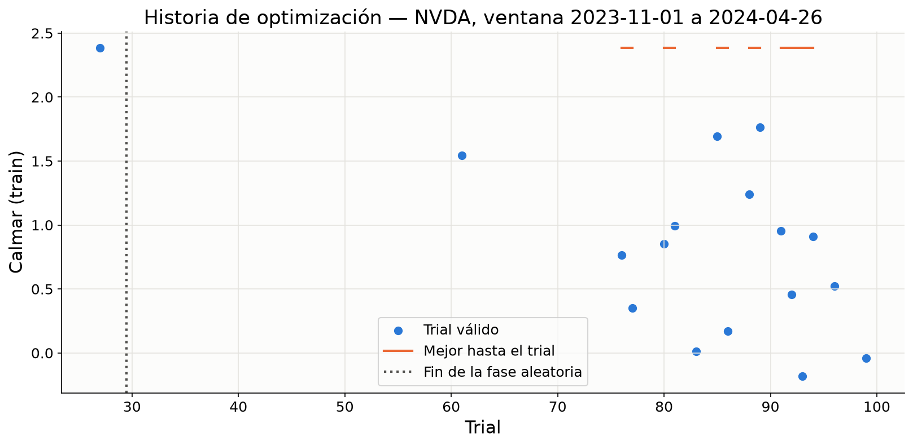
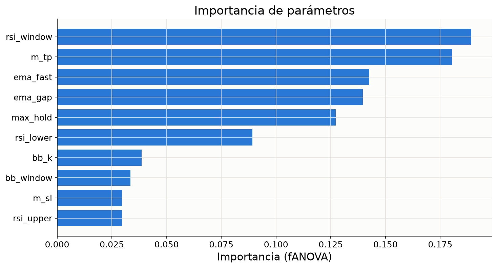
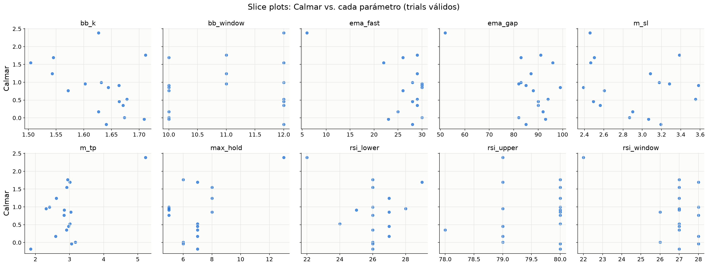
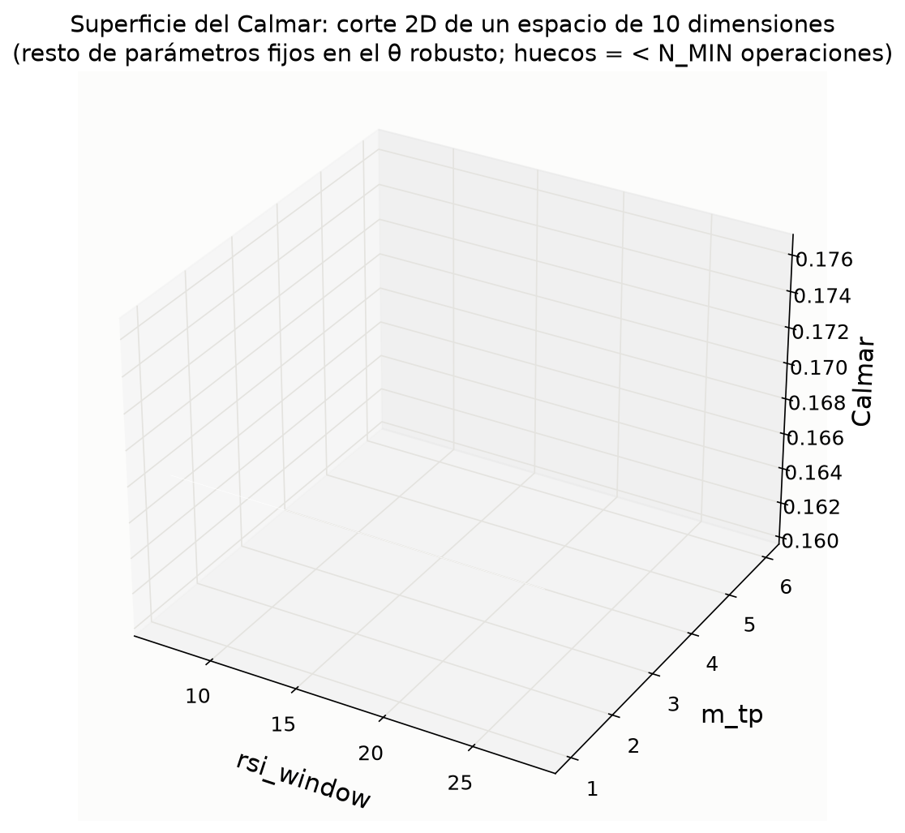

## 6. Métricas por conjunto

### WF-OOS (TRAIN)

| Estrategia | Ret. total | CAGR | Vol. | Sharpe | Sortino | MDD | Calmar | # ops | # largas | # cortas | Win rate | PF | Exp. media |
|---|---|---|---|---|---|---|---|---|---|---|---|---|---|
| RP (sistema) | 3.2% | 0.4% | 4.7% | 0.11 | 0.15 | 10.8% | 0.04 | 286 | 216 | 70 | 45.1% | 1.02 | 9.9% |
| RP naive | 1.1% | 0.1% | 4.6% | 0.05 | 0.07 | 11.1% | 0.01 | 286 | 216 | 70 | 45.1% | 0.99 | 9.8% |
| Pesos iguales (EW) | 6.6% | 0.8% | 5.0% | 0.19 | 0.26 | 10.8% | 0.08 | 286 | 216 | 70 | 45.1% | 1.06 | 10.1% |
| Buy & Hold EW | 1678.4% | 44.6% | 36.6% | 1.19 | 1.73 | 61.7% | 0.72 | n/d | n/d | n/d | n/d | n/d | n/d |
| NVDA (estrategia sola) | 25.4% | 2.9% | 18.1% | 0.25 | 0.36 | 45.1% | 0.07 | 67 | 48 | 19 | 47.8% | 1.06 | 16.8% |
| AMZN (estrategia sola) | -6.7% | -0.9% | 12.1% | -0.01 | -0.02 | 29.1% | -0.03 | 61 | 41 | 20 | 39.3% | 0.94 | 17.2% |
| TSLA (estrategia sola) | 65.0% | 6.6% | 21.9% | 0.40 | 0.63 | 43.2% | 0.15 | 65 | 36 | 29 | 49.2% | 1.22 | 18.5% |
| META (estrategia sola) | 4.8% | 0.6% | 13.4% | 0.11 | 0.16 | 31.6% | 0.02 | 62 | 39 | 23 | 38.7% | 1.04 | 17.5% |
| NFLX (estrategia sola) | 12.7% | 1.5% | 14.5% | 0.18 | 0.26 | 28.7% | 0.05 | 62 | 47 | 15 | 45.2% | 1.08 | 19.4% |
| GOOGL (estrategia sola) | 4.5% | 0.6% | 10.9% | 0.11 | 0.14 | 22.4% | 0.03 | 60 | 43 | 17 | 55.0% | 1.05 | 17.2% |

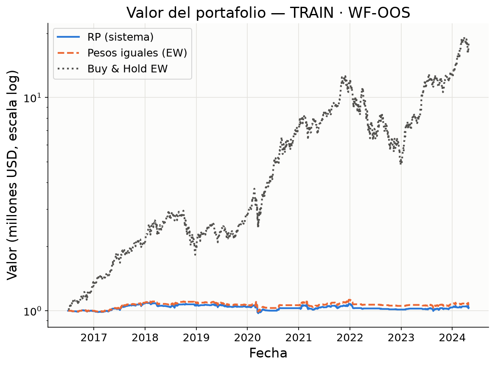
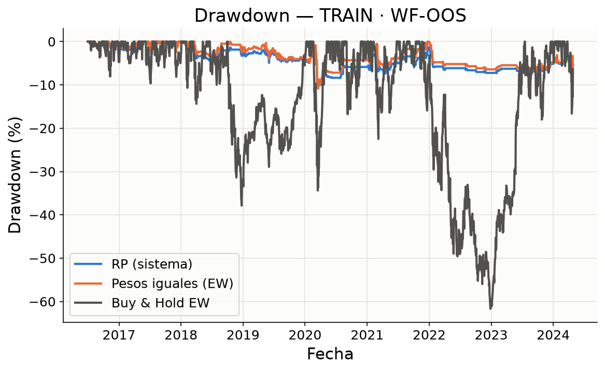
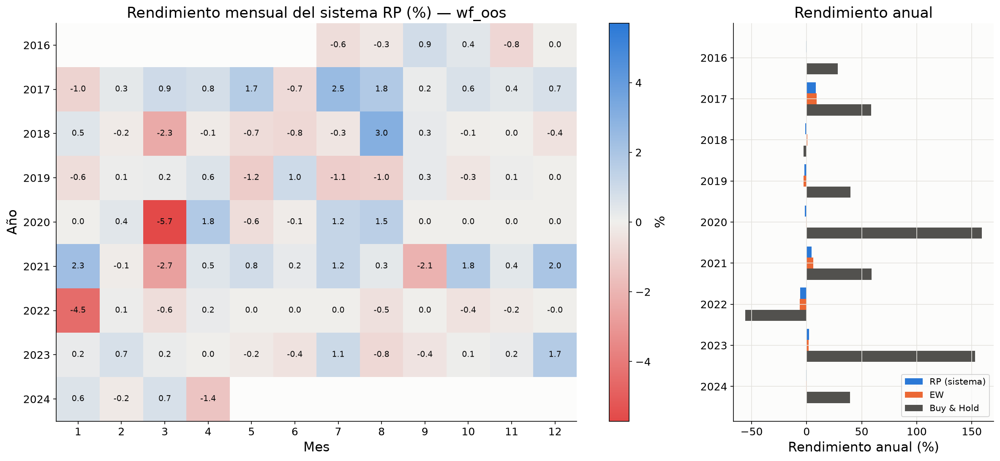

### WF-IS

Promedio por ventana (portafolio sobre su propio train, θ_k in-sample): CAGR 14.1%,
Calmar 7.80 (detalle en `wf_is_por_ventana.csv`).

### TEST

[PENDIENTE: test]

## 7. Análisis de régimen

- **Un régimen de mercado** sobre el índice equiponderado de los 6 activos; ventana móvil de 63 días.
- Features calculadas: volatilidad realizada √(1/n·Σr²) (nivel de riesgo, separa crisis), ATR
  normalizado (rango intradía comparable), fuerza de tendencia |MA21 − MA63|/σ (tendencia en sigmas),
  R² del log-precio contra el tiempo (linealidad de la tendencia) y autocorrelación ρ₁ (persistencia vs.
  reversión). **El K-means usa volatilidad, atr_norm, r2**: silhouette 0.448
  vs. 0.315 con las 5 (objetivo > 0.4). ρ₁ con 63 datos es casi
  ruido (error estándar ≈ 1/√63 ≈ 0.126) y la fuerza de tendencia es redundante con R².
- K = 3 por teoría; `StandardScaler` + `KMeans(k-means++, n_init=10, random_state=42)` ajustados con
  datos ≤ fin del train de cada ventana (historia creciente, para que el cluster de Crisis haya visto
  crisis); en OOS solo `predict`. Re-etiquetado (invariante a los IDs de cluster): mayor volatilidad
  = Crisis; de los otros dos, el de mayor componente de tendencia estandarizado (R²; también
  fuerza de tendencia si estuviera en el subconjunto) = Tendencia; el restante = Reversión.
- **Adaptación a diario:** la clasificación se actualiza cada 5 días hábiles (los lineamientos piden
  1–6 h para datos de 5 min) y un cambio se confirma solo si aparece en 2 actualizaciones seguidas.
  Objetivo de persistencia adaptado: ≥ 10 días hábiles (más que una operación típica).
- Silhouette por ventana: media 0.458 (mín 0.380, máx 0.531).

Persistencia en WF-OOS (TRAIN):

| Régimen | % del tiempo | # rachas | Duración obs. (días) | E[D] Markov (días) |
|---|---|---|---|---|
| Tendencia | 28.5% | 11 | 50.9 | 55.9 |
| Reversión | 37.8% | 10 | 74.3 | 74.3 |
| Crisis | 33.8% | 8 | 83.1 | 83.1 |

Persistencia en TEST: [PENDIENTE: test]

Transiciones en WF-OOS: 28; posiciones abiertas al momento de una
transición: 34; cierres por entrada a Crisis:
14. Reglas aplicadas: La posición abierta conserva su SL/TP de entrada. Las entradas nuevas usan el θ del régimen nuevo. El m nuevo entra en la siguiente revisión de rebalanceo. Si el nuevo régimen es Crisis: al open siguiente se cierran las posiciones abiertas con |s| < 1 y el resto se ajusta a m = 0.3 (revisión inmediata).

Desempeño diario del sistema por régimen (IC 95% bootstrap, 1000 remuestreos):

| Serie | Régimen | Días | Media diaria | IC inf | IC sup | Vol. anual | Sharpe | MDD |
|---|---|---|---|---|---|---|---|---|
| RP (sistema) | Tendencia | 559 | -0.001% | -0.037% | 0.035% | 6.9% | -0.04 | 8.1% |
| RP (sistema) | Reversión | 743 | 0.009% | -0.011% | 0.027% | 4.1% | 0.55 | 6.4% |
| RP (sistema) | Crisis | 665 | -0.003% | -0.018% | 0.009% | 2.8% | -0.26 | 5.3% |
| RP naive | Tendencia | 559 | -0.000% | -0.033% | 0.036% | 6.7% | -0.00 | 7.6% |
| RP naive | Reversión | 743 | 0.006% | -0.013% | 0.024% | 4.0% | 0.41 | 6.4% |
| RP naive | Crisis | 665 | -0.004% | -0.019% | 0.007% | 2.7% | -0.40 | 5.3% |
| Pesos iguales (EW) | Tendencia | 559 | -0.001% | -0.039% | 0.038% | 7.3% | -0.03 | 8.9% |
| Pesos iguales (EW) | Reversión | 743 | 0.012% | -0.008% | 0.031% | 4.3% | 0.69 | 6.5% |
| Pesos iguales (EW) | Crisis | 665 | -0.001% | -0.018% | 0.012% | 3.0% | -0.10 | 5.6% |
| Buy & Hold EW | Tendencia | 559 | 0.269% | 0.093% | 0.459% | 35.7% | 1.90 | 25.7% |
| Buy & Hold EW | Reversión | 743 | 0.119% | -0.004% | 0.241% | 26.9% | 1.12 | 46.4% |
| Buy & Hold EW | Crisis | 665 | 0.152% | -0.064% | 0.372% | 45.7% | 0.84 | 49.3% |

Correlación promedio entre pares por régimen: Tendencia 0.43, Reversión 0.43, Crisis 0.56.

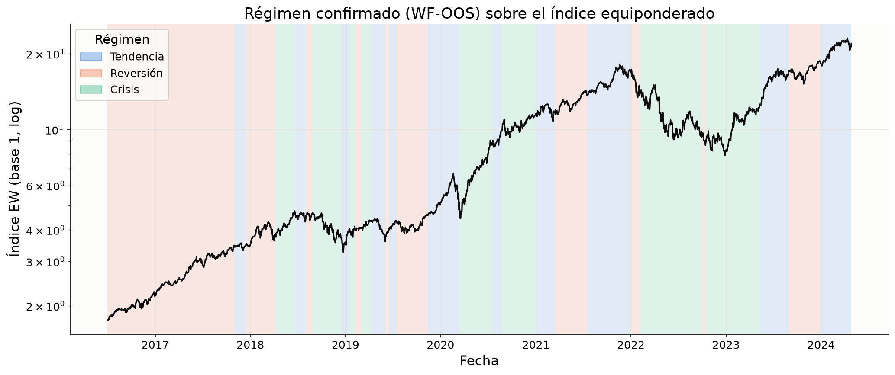
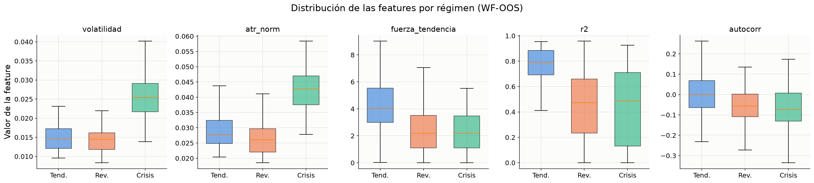
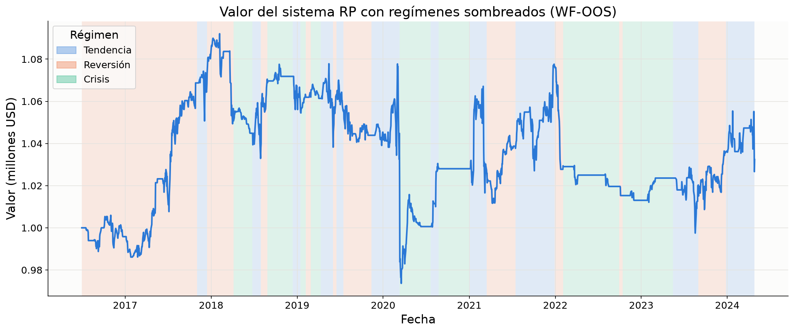
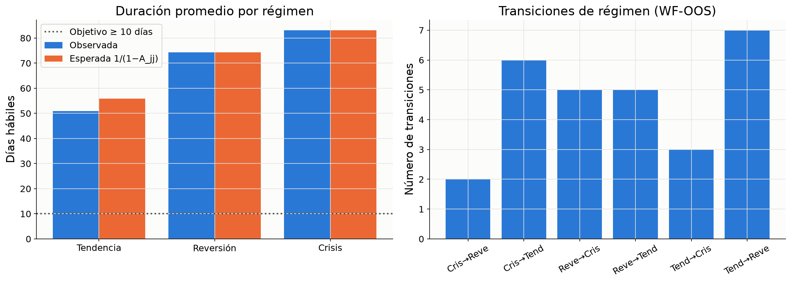
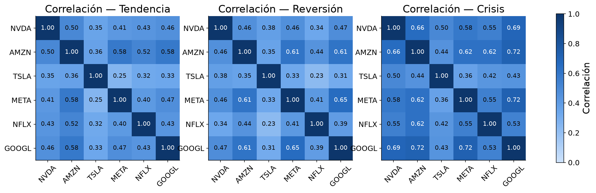

## 8. Metodología del portafolio (notas "Fundamentos Matemáticos de Risk Parity")

1. **De R_p a σ_p:** R_p = wᵀR, σ_p² = wᵀΣw, σ_p = √(wᵀΣw). Σ siempre sobre rendimientos (los precios
   no son estacionarios y dan correlaciones espurias).
2. **Contribución marginal:** MRC_k = ∂σ_p/∂w_k = (Σw)_k/σ_p = Cov(R_k, R_p)/σ_p.
3. **Contribución total y Euler:** RC_i = w_i(Σw)_i/σ_p y Σ_i RC_i = σ_p exacto (probado a 1e-10),
   así que RC_i/σ_p es un porcentaje genuino del riesgo.
4. **Condición de RP:** RC_i = σ_p/n ⇔ w_i(Σw)_i = w_j(Σw)_j, Σw_i = 1, w_i > 0. No usa rendimientos esperados.
5. **Naive vs. Spinu:** naive w_i ∝ 1/σ_i es exacto solo con correlaciones iguales. El sistema usa
   min_{y>0} ½yᵀΣy − (1/n)Σ ln y_i, w = y/Σy (convexa, solución única; L-BFGS-B con gradiente
   Σy − 1/(n·y)). No se minimiza Σ(RC_i − RC_j)² porque es no convexo y depende del punto inicial.
   Verificación en cada rebalanceo: max|RC_i/σ_p − 1/n| < 1e-4. Con nuestros datos, la diferencia
   máxima promedio entre pesos RP y naive es 1.86% por activo.
6. **Σ:** muestral, 504 días (n/T ≈ 0.012), solo datos ≤ t, re-estimada en cada revisión. Comparación
   de estabilidad con EWMA (λ = 0.94, T_eff ≈ 17 días) y Ledoit-Wolf:

| Estimador | Desv. media de pesos | Turnover anual implícito | Costo anual implícito | Nº condición medio |
|---|---|---|---|---|
| muestral | 0.0142 | 0.19 | 0.046% | 23.7 |
| ewma | 0.0302 | 3.43 | 0.857% | 47.7 |
| ledoit_wolf | 0.0138 | 0.18 | 0.045% | 18.5 |

7. **Agregación (Paso 7):** w̃_i = w_i^RP·s_i y w^target = m(régimen)·w̃/max(1, Σ|w̃|), con
   m = 1.0 / 0.7 / 0.3 (Tendencia / Reversión / Crisis; en Crisis solo entradas 3 de 3). s_i es la
   del momento de entrada y se conserva mientras la posición viva. **Conflictos:** si corr > 0.7 y
   señales opuestas, se queda la de mayor |s| (empate: ambas × 0.5); la política actuó
   3 veces en WF-OOS. Consecuencia del diseño: una posición aislada pesa
   ≈ w^RP·|s|·m ≈ 1/6 × 2/3 ≈ 11% del capital, y la exposición media fue 9.9%.
8. **Rebalanceo:** T_t = ½Σ|w_t − w_{t⁻}| contra el peso post-drift; costo ≈ T̄·f·2c
   (0.0024% anual por fórmula vs. 0.909%
   anual cobrado por el motor, que incluye todas las entradas y salidas). Disparador híbrido: en
   fechas de calendario f se rebalancea solo si ‖w − w^target‖₁ > δ. Barrido en TRAIN →
   **f = diario, δ = 0.2**.

**Ilusión del 50/50 con nuestros datos:** con pesos iguales, TSLA + NVDA aportan
41.3% del riesgo con 33.3% del capital.

**¿Por qué Risk Parity?** No requiere rendimientos esperados (a diferencia de Markowitz) sino solo Σ,
el insumo que se estima con error aceptable; pesos iguales no es riesgo igual; la descomposición es
exacta por Euler; y se integra con señales y régimen antes de volverse una orden.

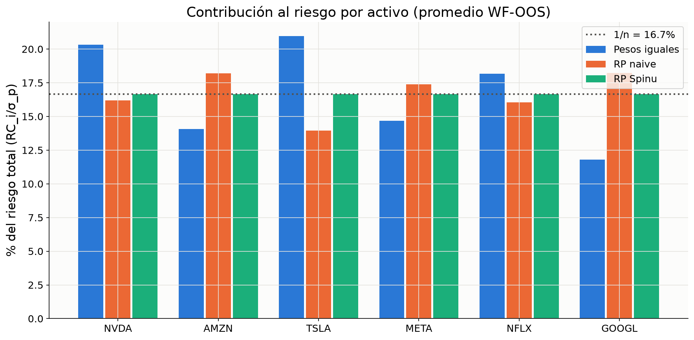
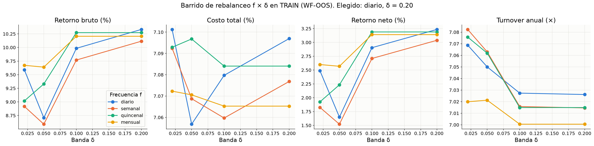
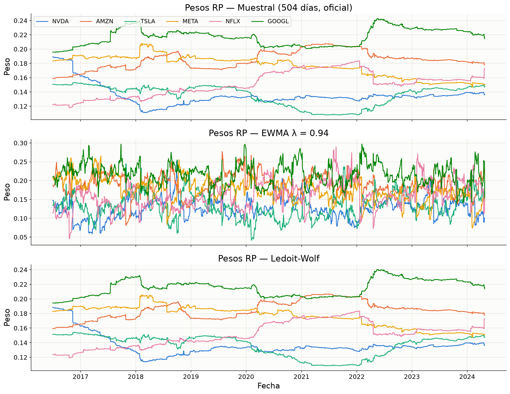
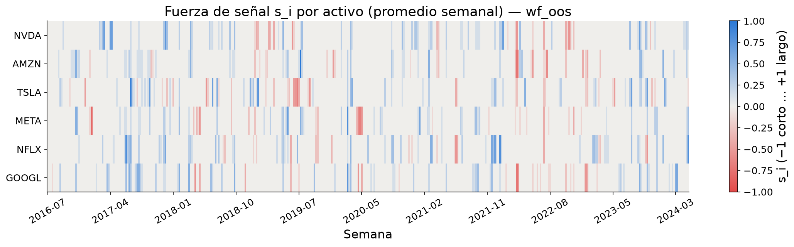

## 9. Estrategia individual de cada activo

θ congelado (variante **por_activo**, última ventana 2023-11-01 a
2024-04-26):

| Activo | Régimen | EMA rápida/lenta | RSI (n, inf, sup) | BB (n, k) | SL/TP (×ATR) | max_hold |
|---|---|---|---|---|---|---|
| NVDA | Tendencia | 24/118 | 27, 22, 65 | 10, 1.59 | 2.69/5.75 | 10 |
| NVDA | Reversión | 18/90 | 24, 24, 80 | 12, 1.67 | 2.92/4.09 | 10 |
| NVDA | Crisis | 18/90 | 24, 24, 80 | 12, 1.67 | 2.92/4.09 | 10 |
| AMZN | Tendencia | 13/29 | 26, 32, 77 | 10, 1.63 | 3.13/2.40 | 22 |
| AMZN | Reversión | 13/29 | 26, 32, 77 | 10, 1.63 | 3.13/2.40 | 22 |
| AMZN | Crisis | 13/29 | 26, 32, 77 | 10, 1.63 | 3.13/2.40 | 22 |
| TSLA | Tendencia | 24/91 | 20, 29, 72 | 12, 1.63 | 2.10/2.56 | 16 |
| TSLA | Reversión | 24/91 | 20, 29, 72 | 12, 1.63 | 2.10/2.56 | 16 |
| TSLA | Crisis | 24/91 | 20, 29, 72 | 12, 1.63 | 2.10/2.56 | 16 |
| META | Tendencia | 6/95 | 22, 23, 62 | 16, 1.62 | 1.19/4.80 | 38 |
| META | Reversión | 6/95 | 22, 23, 62 | 16, 1.62 | 1.19/4.80 | 38 |
| META | Crisis | 6/95 | 22, 23, 62 | 16, 1.62 | 1.19/4.80 | 38 |
| NFLX | Tendencia | 27/110 | 9, 35, 75 | 34, 1.70 | 2.70/1.74 | 20 |
| NFLX | Reversión | 27/110 | 9, 35, 75 | 34, 1.70 | 2.70/1.74 | 20 |
| NFLX | Crisis | 27/110 | 9, 35, 75 | 34, 1.70 | 2.70/1.74 | 20 |
| GOOGL | Tendencia | 12/36 | 7, 38, 78 | 30, 2.82 | 1.06/5.83 | 20 |
| GOOGL | Reversión | 30/113 | 12, 31, 68 | 10, 1.88 | 3.89/3.89 | 6 |
| GOOGL | Crisis | 30/113 | 12, 31, 68 | 10, 1.88 | 3.89/3.89 | 6 |

Estrategia sola en cada activo (100% del capital, WF-OOS):

| Estrategia | Ret. total | CAGR | Vol. | Sharpe | Sortino | MDD | Calmar | # ops | # largas | # cortas | Win rate | PF | Exp. media |
|---|---|---|---|---|---|---|---|---|---|---|---|---|---|
| NVDA (estrategia sola) | 25.4% | 2.9% | 18.1% | 0.25 | 0.36 | 45.1% | 0.07 | 67 | 48 | 19 | 47.8% | 1.06 | 16.8% |
| AMZN (estrategia sola) | -6.7% | -0.9% | 12.1% | -0.01 | -0.02 | 29.1% | -0.03 | 61 | 41 | 20 | 39.3% | 0.94 | 17.2% |
| TSLA (estrategia sola) | 65.0% | 6.6% | 21.9% | 0.40 | 0.63 | 43.2% | 0.15 | 65 | 36 | 29 | 49.2% | 1.22 | 18.5% |
| META (estrategia sola) | 4.8% | 0.6% | 13.4% | 0.11 | 0.16 | 31.6% | 0.02 | 62 | 39 | 23 | 38.7% | 1.04 | 17.5% |
| NFLX (estrategia sola) | 12.7% | 1.5% | 14.5% | 0.18 | 0.26 | 28.7% | 0.05 | 62 | 47 | 15 | 45.2% | 1.08 | 19.4% |
| GOOGL (estrategia sola) | 4.5% | 0.6% | 10.9% | 0.11 | 0.14 | 22.4% | 0.03 | 60 | 43 | 17 | 55.0% | 1.05 | 17.2% |

Contribución de cada activo dentro del portafolio (WF-OOS):

| Activo | PnL neto (USD) | Costos (USD) | # ops | # largas | # cortas | Win rate |
|---|---|---|---|---|---|---|
| NVDA | 57,484 | 9,523 | 47 | 39 | 8 | 51.1% |
| AMZN | -2,260 | 11,644 | 45 | 34 | 11 | 42.2% |
| TSLA | 56,853 | 9,999 | 51 | 29 | 22 | 51.0% |
| META | -62,848 | 12,649 | 47 | 36 | 11 | 29.8% |
| NFLX | -30,929 | 12,164 | 52 | 40 | 12 | 40.4% |
| GOOGL | -1,139 | 14,412 | 44 | 38 | 6 | 56.8% |

Responsables: Milca (NFLX, TSLA), Paula (AMZN, META), Arturo (GOOGL, NVDA).

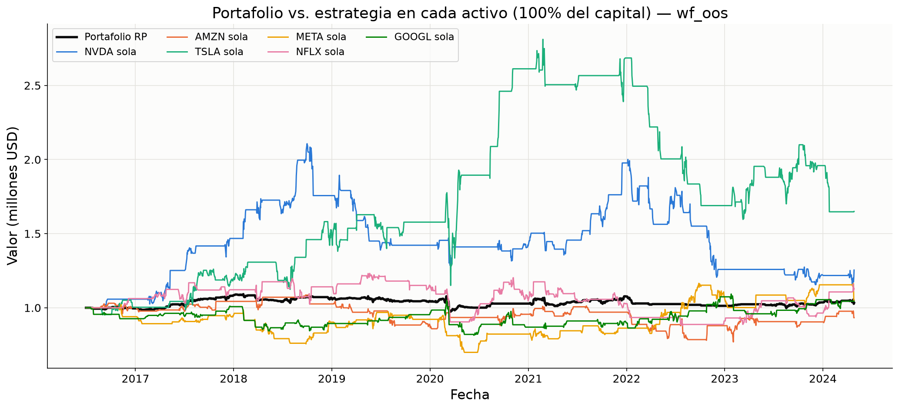

## 10. Comparaciones

| Pesos | CAGR | Vol. | MDD | Calmar | Turnover | Máx RC_i/σ_p | RC TSLA+NVDA |
|---|---|---|---|---|---|---|---|
| rp | 0.4% | 4.7% | 10.8% | 0.04 | 7.03 | 16.7% | 33.3% |
| naive | 0.1% | 4.6% | 11.1% | 0.01 | 7.02 | 18.2% | 30.1% |
| ew | 0.8% | 5.0% | 10.8% | 0.08 | 7.02 | 21.0% | 41.3% |

Rolling vs. anchored (WF-OOS, rebalanceo por defecto semanal/0.10): Calmar 0.03 vs. -0.06;
CAGR 0.3% vs. -1.1%.

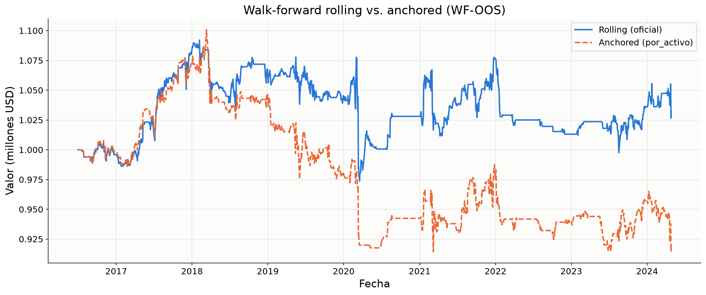

## 11. Robustez y costos

**2 de 3 vs. un indicador (WF-OOS, mismo θ por ventana):**

| Regla | # ops | Calmar | CAGR | MDD |
|---|---|---|---|---|
| 2 de 3 | 286 | 0.04 | 0.4% | 10.8% |
| solo EMA | 1,508 | 0.13 | 4.6% | 35.1% |
| solo RSI | 706 | -0.14 | -5.8% | 42.6% |
| solo Bollinger | 850 | -0.17 | -8.5% | 50.2% |

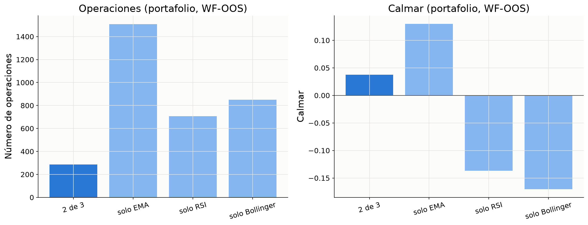

**Sensibilidad ±20%** (θ congelado como base, uno a la vez, portafolio sobre TRAIN): Calmar base
0.13; parámetro más sensible: **max_hold** (rango de Calmar 0.19).
Con ±20% en los parámetros de θ, el Calmar conserva el signo de la base en 90% de los
casos, queda dentro de ±50% de la base en 80% y va de -0.00 a
0.26. Nota: la base de sensibilidad usa el θ congelado y el modelo de régimen
congelado sobre todo el tramo de TRAIN, por eso no coincide con el Calmar WF-OOS.

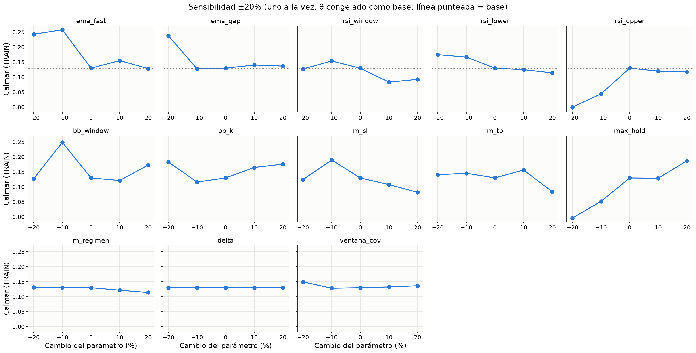

**Curva de costos:** equilibrio en 0.183% por lado → margen de seguridad
1.47× frente a 0.125%. Operaciones por año: 36.6; costo
anual por turnover: 0.909% del capital.

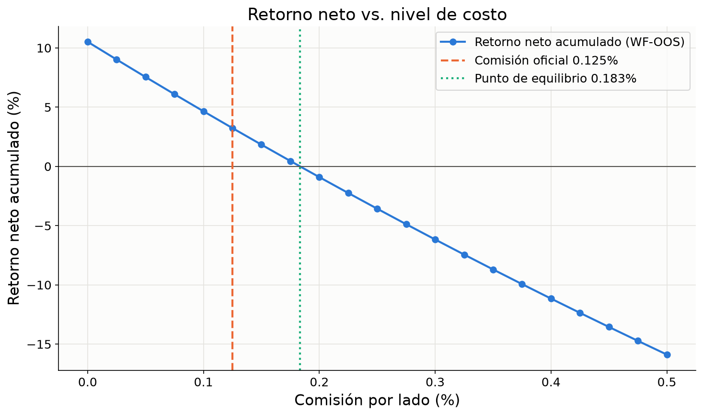
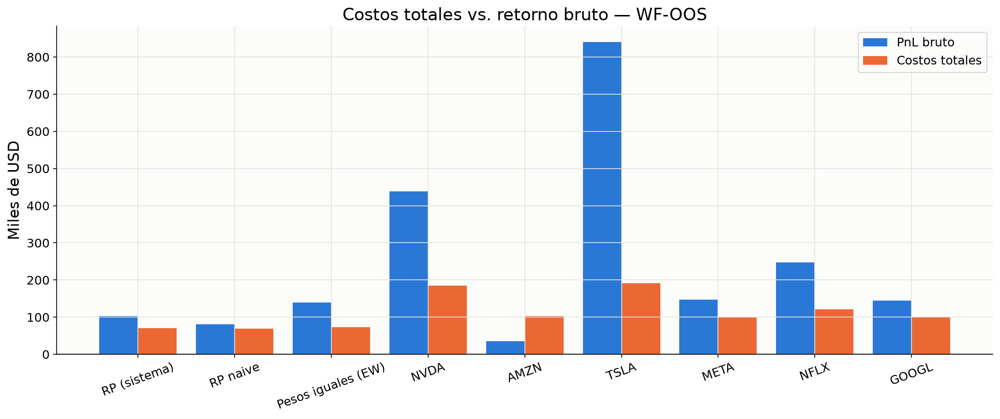

## 12. Supuestos y decisiones

- Periodo 2015-01-01 a 2026-08-31 (no hizo falta reducirlo: la etapa TRAIN completa tomó 0.30 h).
- La regla 2 de 3 nunca abre contra la tendencia de la EMA (ver sección 3).
- N_MIN = 5 (global) / 3 (régimen) en lugar de 10/5 (ver sección 5); compartido: 6× esos valores.
- Fallback declarado: régimen con < 20 días en el train o sin trials válidos → θ global de la ventana;
  estudio global sin trials válidos → θ global de la última ventana previa válida (causal; el sistema
  conserva sus últimos parámetros optimizados); solo sin ninguna ventana previa válida → θ por defecto.
- N_MIN en anchored escala con los días de la muestra (global) o del régimen (por régimen); en
  rolling vale exactamente 5 y 3.
- θ robusto = mediana del top 10% de trials válidos (al menos 1 trial).
- Features del K-means: volatilidad, atr_norm, r2 (selección con silhouette, solo en TRAIN).
- Modelo de régimen ajustado con historia creciente ≤ fin del train de cada ventana (la ventana de 6
  meses no contiene crisis en muchos casos).
- Régimen actualizado cada 5 días hábiles con persistencia de 2 actualizaciones; inicialización en el
  primer día con modelo vigente. El rendimiento de t se atribuye al régimen vigente al cierre de t−1.
- Al entrar a Crisis se cierran al open siguiente las posiciones con |s| < 1 y el resto se ajusta a m = 0.3.
- Gap: el open se evalúa contra SL/TP antes de ejecutar las órdenes pendientes del mismo activo.
- Límite de no apalancamiento Σ|q·P| ≤ Equity/(1+c) para que el efectivo cubra la comisión.
- Pesos de largo plazo con ventana creciente (mínimo 126 días) al inicio de la muestra.
- Paralelización por ventana (las ventanas son independientes), no por activo.
- Experimento de un indicador con el mismo θ por ventana (aísla el efecto de la regla).
- Sensibilidad de m(régimen) con tope en 1.0.
- Spread de 2 bps = spread completo (se paga la mitad por lado); impacto η = 0.1 con ADV de 20 días.
- Turnover del ejemplo de las notas: sin las notas a mano, la prueba usa un ejemplo construido por
  el equipo (0.10 contra el objetivo viejo vs. 0.05 contra el peso post-drift).
- Las "operaciones" contadas son las cerradas; una posición abierta al final se marca a mercado.

## 13. Respuestas a las 7 preguntas

1. **¿Qué aporta la regla 2 de 3 frente a un solo indicador?** Con 2 de 3 hubo 286 operaciones, Calmar 0.04 y MDD 10.8%; solo EMA: 1,508 operaciones, Calmar 0.13, MDD 35.1%, costos 451,879 USD; solo RSI: 706 operaciones, Calmar -0.14, MDD 42.6%, costos 171,725 USD; solo Bollinger: 850 operaciones, Calmar -0.17, MDD 50.2%, costos 187,306 USD. La regla filtra operaciones (menos operaciones que 100% de los indicadores solos), reduce costos y drawdown, y supera el Calmar de 67% de ellos. Si algún indicador solo tiene mayor Calmar, lo logra con mucho más drawdown y costo.
2. **¿Cuánto se degrada el desempeño de train a test? ¿Qué proporción sobrevive?** WFE de rendimiento
   0.02 y de Calmar 0.00 (rolling): CAGR WF-IS promedio
   14.1% vs. WF-OOS 0.3%. Sobrevive alrededor de 2% del rendimiento in-sample: por debajo de 0.5, el resultado in-sample es mayormente ruido ajustado.
   Degradación TRAIN → TEST: [PENDIENTE: test].
3. **¿Qué tan sensible es a ±20%? ¿Meseta o pico?** Calmar base 0.13; el parámetro más
   sensible es max_hold. Con ±20% el Calmar conserva el signo en 90% de los casos
   y solo 80% queda dentro de ±50% de la base (rango -0.00 a 0.26).
   La mayoría de las perturbaciones conserva el resultado: se parece más a una meseta.
4. **¿A qué costo deja de ser rentable?** A 0.183% por lado; margen de seguridad 1.47× frente a 0.125%.
   En el escenario realista (spread 2 bps, borrow 0.5%, impacto) el CAGR pasa de
   1.5% a 1.3%
   y el Calmar de 0.13 a 0.11.
5. **¿El desempeño difiere entre regímenes?** Tendencia: media diaria -0.001% [-0.037%, 0.035%], Sharpe -0.04, MDD 8.1%; Reversión: media diaria 0.009% [-0.011%, 0.027%], Sharpe 0.55, MDD 6.4%; Crisis: media diaria -0.003% [-0.018%, 0.009%], Sharpe -0.26, MDD 5.3%. Todos los intervalos incluyen 0 y se traslapan: no hay diferencias significativas. La capa de régimen aporta sobre todo control de riesgo (m = 0.3 y solo 3 de 3 en Crisis, θ distintos por régimen), no un retorno distinto demostrable.
6. **¿Risk Parity mejora el Calmar frente a pesos iguales?** No: RP Calmar 0.04 vs. EW
   0.08 (naive 0.01); MDD 10.8% vs. 10.8%;
   CAGR 0.4% vs. 0.8%. Contribución máxima al riesgo de un activo: RP
   16.7% vs. EW 21.0%. Con pesos iguales TSLA+NVDA aportan
   41.3% del riesgo con 33.3% del capital. RP vs. naive difieren a lo más
   1.86% en pesos promedio: con correlaciones parecidas, naive ≈ Spinu. RP sí iguala
   las contribuciones al riesgo (su objetivo), pero como la exposición media es ~10% y las señales
   dominan el P&L, el reparto de pesos casi no mueve el Calmar.
7. **Tres limitaciones para operar con capital real:** (i) universo de 6 mega-cap tecnológicas muy
   correlacionadas (correlación media 0.47) elegidas *ex post*
   (supervivencia): la diversificación es limitada y el régimen de Crisis afecta a todos a la vez;
   (ii) pocas operaciones por ventana (36.6 por año en todo el portafolio)
   → Calmar con mucho error de estimación y riesgo de minería de datos (416,300 configuraciones
   probadas); (iii) ejecución idealizada: llenado completo al open/al nivel de SL/TP, sin impacto,
   sin restricciones de préstamo de títulos ni margin calls intradía.

## 14. Advertencia de ejecución

El backtest supone ejecución completa al precio modelado, sin impacto de mercado ni fallas de
ejecución. Estimación con el sistema congelado sobre TRAIN:

| Escenario | CAGR | Calmar | MDD | Costos (USD) |
|---|---|---|---|---|
| oficial (solo comisión) | 1.5% | 0.13 | 11.4% | 83,983 |
| + spread 2 bps | 1.4% | 0.12 | 11.5% | 90,416 |
| + borrow fee 0.5% | 1.5% | 0.13 | 11.4% | 85,181 |
| + impacto η=0.1 | 1.4% | 0.12 | 11.5% | 91,487 |
| realista (todo junto) | 1.3% | 0.11 | 11.6% | 99,039 |

Barrido de slippage (por lado): CAGR de 1.5% (0 bps) a -0.2%
(20 bps); Calmar de 0.13 a -0.01.

## Anexo: evaluación secundaria del TEST

[PENDIENTE: test]
